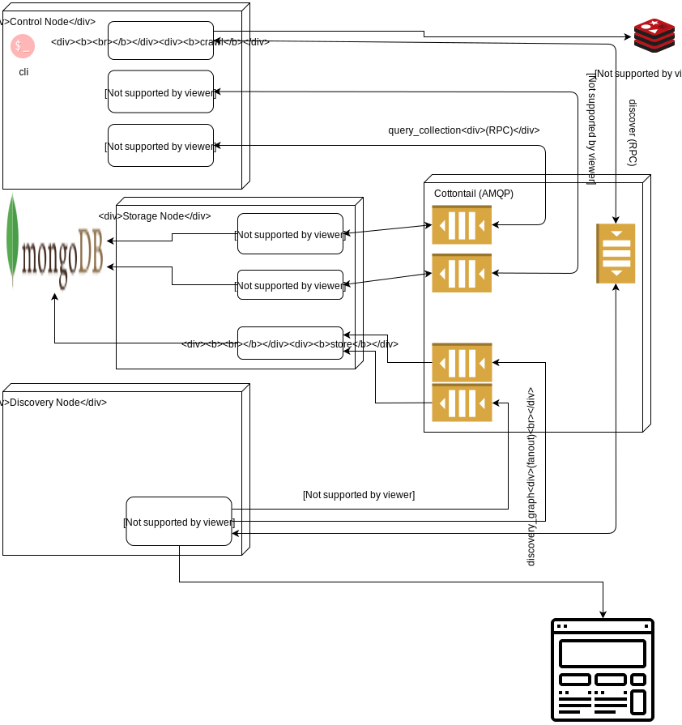

# Architecture

`WCraaS` uses `RabbitMQ` as its core communication medium, building on two core patterns:

* RPC
* Fanout

## Components

* [Control Node]()
* [URL Cache]()
* [Cottontail]()
* [Discovery Node]()
* [Storage Node]()
* [MongoDB]()
